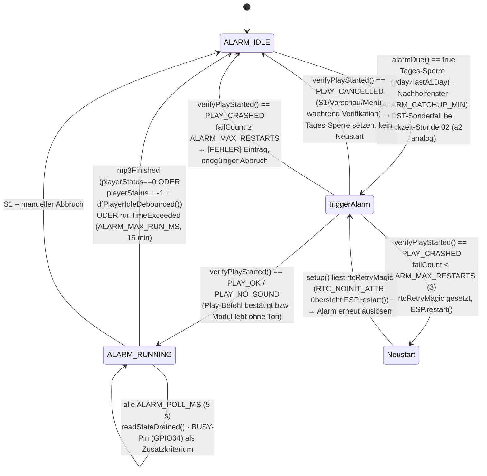
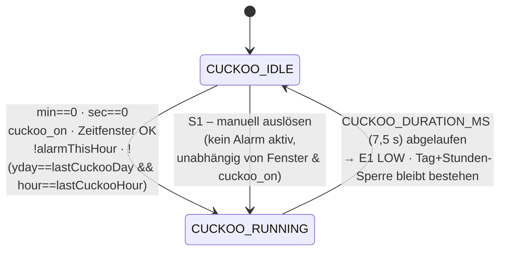
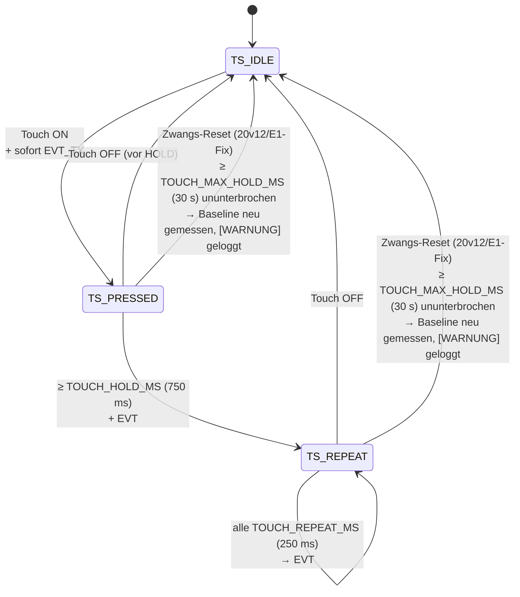
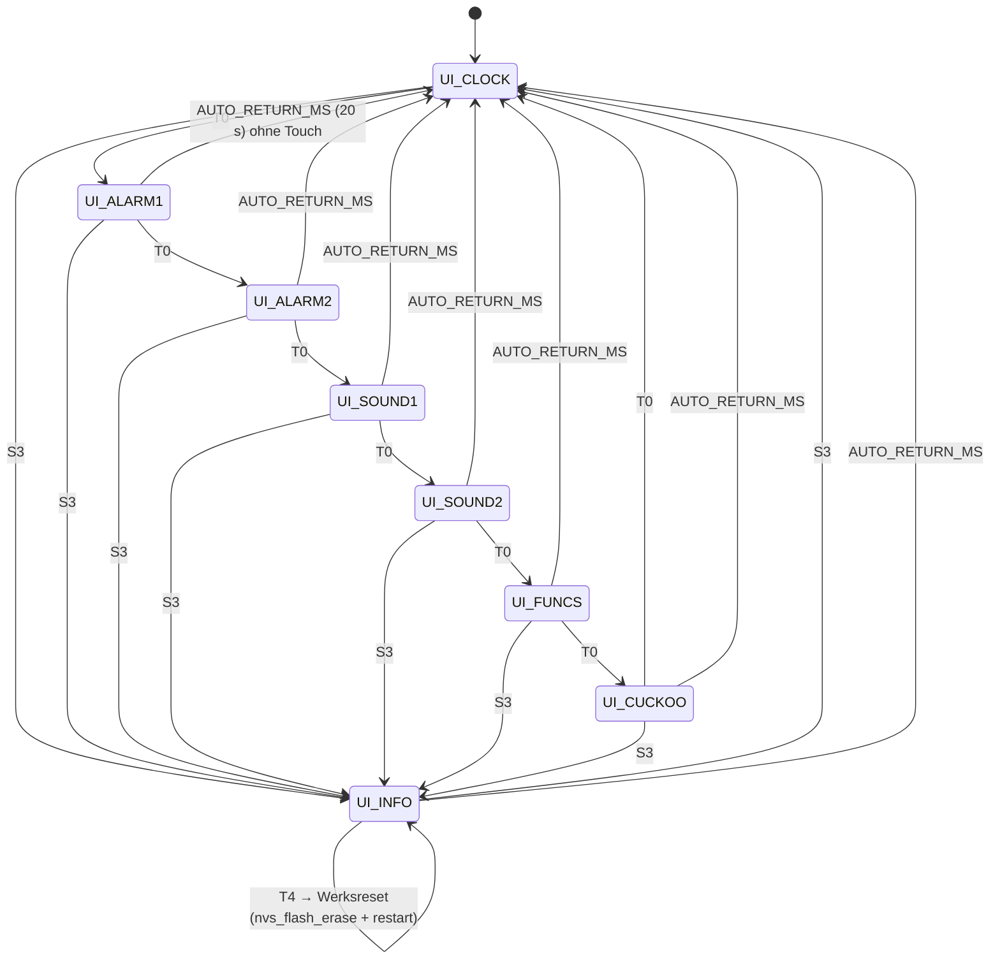

# bTn Wecker – State Machines

*Firmware 20v29 · Mermaid-Diagramme*

> ⚠ **Maßgeblich ist diese Datei.** Die ursprüngliche Vorlage
> `DOC/bTn_Wecker_StateMachines.pptx` (Stand 2026-04-20) ist seit vielen
> Firmware-Ständen nicht mehr nachgeführt und nur noch historisch – Änderungen
> hier NICHT in die pptx zurückspiegeln.

> **Pin-Hinweis:** Taster S1=GPIO33, S2=GPIO32 (seit 20v28 getauscht), S3=GPIO0.
> Ausgänge E1=GPIO27 (Kuckuck), E2=GPIO25 (Mühlrad-Motor), E3=GPIO26 (Licht) – seit
> 20v29 umbelegt. Beide Tauschaktionen betreffen nur die Pin-Konstanten in
> `SysConf_*.h`, keine der hier gezeigten State-Machines.

---

## 1. Alarm-State-Machine

*alarmTask (Core 0, Pri 2) · Takt 500 ms*

**Bedingungen**

- **IDLE → triggerAlarm:** `alarmDue(a1_on, a1_hour, a1_min, hour, min, yday, lastA1Day, isdstNow)` (20v21) – pegel-/tagesbasiert statt Minuten-Flanke: `yday != lastA1Day` (Tages-Sperre, ersetzt die frühere Minuten-Sperre `lastA1Min`) UND Differenz Ist-/Soll-Zeit innerhalb `ALARM_CATCHUP_MIN` (60 min, Nachholfenster für Zeitsprünge/Reboots/Zeitumstellung); Alarm 2 analog.
- **Tages-Sperre aufheben (20v22/20v27):** `lastA1Day`/`lastA2Day` = `0xFFFF` wird NICHT mehr bei jedem `h+`/`min+`-Tastendruck in `onAlarm1()`/`onAlarm2()` gesetzt, sondern erst in `uiTransition()` beim Verlassen von `UI_ALARM1`/`UI_ALARM2` – und auch dann nur, wenn `alarm1TimeEdited`/`alarm2TimeEdited` gesetzt ist (Weckzeit wurde per T3/T4 tatsächlich verändert). Verhindert (a) vorzeitiges Auslösen auf Zwischenständen beim Durchscrollen einer neuen Weckzeit und (b) erneutes Auslösen, wenn die Alarm-Seite nur angeschaut wird.
- **DST-Sonderfall (20v21, nur Weckzeiten mit Stunde 02):** `updateDstDayFlags()` erkennt beide Umstellungstage TZ-generisch über `mktime()`/`tm_isdst` (Vergleich Stunde 1 vs. Stunde 4). Frühjahr (`dstSpringForwardToday`): effektive Stunde wird in `alarmDue()` um 1h vorgezogen (`effH = h-1`), da die Wanduhrzeit 02:00–02:59 an diesem Tag nicht existiert. Herbst (`dstFallBackToday`): der erste (CEST-)Durchlauf der doppelten Stunde 02 wird per `isdstNow==1` ignoriert, erst der zweite (CET-)Durchlauf löst aus. Zweck: der reale zeitliche Abstand Weckzeit→Termin bleibt unabhängig von der Zeitumstellung erhalten.
- **Alarm 1 Vorrang:** Alarm 2 wird nur per `else if` geprüft → Alarm 1 hat Vorrang bei gleicher Zeit.
- **triggerAlarm() → ALARM_RUNNING:** `drainSerial2Pre()` räumt den Serial2-Puffer über die Bibliothek ab (12v14/12v19), setzt Lautstärke mit Untergrenze `ALARM_MIN_VOL` (10, 20v12 – schützt gegen ein durch klemmendes Touch-Pad auf 0 heruntergezähltes `vol`, ohne die gespeicherte Einstellung zu verändern), dann `playFolder()` + `verifyPlayStarted()` (bis zu `VERIFY_PLAY_RETRIES`=3 Versuche à `VERIFY_PLAY_DELAY_MS`=500 ms). `PLAY_OK` und `PLAY_NO_SOUND` (Modul lebt, Datei startet nicht hörbar – `alarmSilentFallback`) laufen beide in denselben Erfolgspfad: Motor/Licht ein, `wakeDisplay()` (10v03), `alarmState = ALARM_RUNNING`, Tages-Sperre wird über `lockAlarmDayGuard()` erst NACH bestätigtem Start gesetzt.
- **triggerAlarm() → ALARM_IDLE (PLAY_CANCELLED, 20v12/20v15):** Nutzer hat während der ~1,5 s-Verifikation bewusst gestoppt (S1 immer; Sound-Vorschau/Funktionswahl-Menü nur wenn der Alarm bereits hörbar `ALARM_RUNNING` war, siehe `requestAlarmCancelIfActive(includeStartup)`). Kein Neustart, Tages-Sperre wird trotzdem gesetzt (sonst löste `alarmDue()` im nächsten Tick sofort erneut aus).
- **triggerAlarm() → Neustart (12v05/12v07/12v10, weiterhin RTC_NOINIT_ATTR-basiert):** Bestätigt der DFPlayer den Play-Befehl über keinen der Versuche (`PLAY_CRASHED`), gilt er als abgestürzt. Alarmnummer/Datei/Minute/Fehlversuche werden in `RTC_NOINIT_ATTR`-Variablen (`rtcRetryMagic`/`-Alarm`/`-FileNo`/`-Min`/`-Count`) hinterlegt (übersteht `ESP.restart()`, NICHT aber Reset-Taster/Neuflashen – das ist ein echter Power-On), danach Neustart. Ab `ALARM_MAX_RESTARTS` (3, seit 12v10) Fehlversuchen kein weiterer Neustart mehr, Alarm bricht für diesen Tag endgültig ab (roter `[FEHLER]`-Eintrag im Web-Log).
- **watchdogTask-Fallback (12v12):** Friert `alarmTask` mitten in `triggerAlarm()` ein (`alarmTriggerInFlight`-Marker), setzt `watchdogTask` selbst `rtcRetryMagic` vor seinem eigenen Neustart – sonst bliebe der Alarm nach diesem Freeze-Neustart ersatzlos aus. Seit 20v06 redundant (siehe unten), aber als Sicherheitsnetz belassen.
- **RUNNING → IDLE (mp3Finished, 20v00/20v03):** `playerStatus==0` (MP3 beendet) ODER `playerStatus==-1` UND `dfPlayerIdleDebounced()` bestätigt idle über den BUSY-Pin (GPIO34, Hardware ab 2v0, 3 Abtastungen à 5 ms). Löst den bisherigen reinen UART-Timeout-Fallback ab. Bei `alarmSilentFallback` (PLAY_NO_SOUND) bleibt dieser Ausstieg gesperrt – einziger Ausstieg dann `runTimeExceeded`.
- **RUNNING → IDLE (runTimeExceeded, 20v05/A3):** harte Obergrenze `ALARM_MAX_RUN_MS` (15 min) als Rückfallebene, falls der BUSY-Pin dauerhaft LOW hängt (Modulfehlfunktion/Leitungsfehler) und `dfPlayerIdleDebounced()` nie „idle" meldet.
- **playerMutex:** schützt `playFolder()` und `readState()`/`readStateDrained()`. `vTaskDelay(1 ms)` liegt AUSSERHALB des Mutex (Projektregel).
- **playerStatus:** `== 0` (seit 9v4, war vorher `< 1`) – verhindert Fehlabbruch bei `readState()`-Timeout (UART-Konflikt mit `webLogTask`).
- **readStateDrained() (12v09/13v00):** liest alle vollständigen Frames aus dem Puffer und wertet nur den zuletzt empfangenen Feedback-Wert; wartet nach einem `-1` zusätzlich bis zu `SERIAL2_FEEDBACK_GRACE_MS` (100 ms) aktiv auf einen echten Feedback-Frame, statt sofort aufzugeben (behebt „kein Start-Status nach playFolder").
- **RTC-Merker-Löschung (20v06/B2-Fix):** `rtcRetryMagic` wird bereits beim Setzen von `triggerAlarm()` geschrieben (nicht erst im Fehlerpfad) und beim ersten `playerStatus>0`-Poll bzw. beim Verlassen von `ALARM_RUNNING` wieder gelöscht – ein Freeze/Reset zwischen `playFolder()` und der ersten bestätigten Wiedergabe verliert den Alarm dadurch nicht mehr ersatzlos.

---

## 2. Kuckuck-State-Machine

*alarmTask (Core 0, Pri 2) · Takt 500 ms*

**Bedingungen**

- **Zeitfenster-Prüfung:** normal `cuckoo_onTime ≤ hour ≤ cuckoo_offTime`. Bei Mitternacht-Überlauf (z. B. 22–06): `hour ≥ onTime || hour ≤ offTime`.
- **alarmThisHour:** `(a1_on && a1_min==0 && hour==a1_hour) || (a2_on && a2_min==0 && hour==a2_hour)` → Kuckuck unterdrückt.
- **Tag+Stunden-Sperre (20v04/A6-Fix, ersetzt die frühere reine Minuten-Sperre):** `lastCuckooDay`/`lastCuckooHour` werden beim Auslösen gesetzt und bleiben bis zur nächsten (zwangsläufig anderen) Stunde gesperrt – kein Reset beim Übergang `RUNNING → IDLE` mehr. Grund: die alte Minuten-Sperre hob sich bereits 7,5 s nach Auslösung wieder auf; bei der Oktober-Zeitumstellung durchläuft die Ortszeit 02:00–02:59 zweimal, die zweite volle Stunde 02:00 löste dadurch einen zweiten, ungewollten Kuckuck aus. Die Sperre schützt damit auch vor der doppelten Herbststunde, ohne eine eigene DST-Sonderbehandlung wie beim Alarm zu benötigen.
- **Manuell (S1, in inputTask):** setzt `lastCuckooDay`/`lastCuckooHour` ebenfalls (eigener Zeitstempel statt der gemeinsamen `t_hour`/`t_min`-Globals, da Core-Grenze zu alarmTask).

---

## 3. Touch-State-Machine

*touchTask (Core 0, Pri 2) · Takt TOUCH_POLL_MS (50 ms)*

**Bedingungen**

- **Schwellwert:** `padWert < (baseline − TOUCH_DROP)` → Touch erkannt. Fallback wenn `baseline < TOUCH_DROP`: 80 % der Baseline.
- **Exklusivität:** sobald ein Pad aktiv ist (`TS_PRESSED` / `TS_REPEAT`), werden alle anderen Pads ignoriert. Baseline-Rekalibrierung alle `TOUCH_RECAL_MS` (10 min) im `TS_IDLE`.
- **ISR-Debouncing Stufe 1:** Flanken < `BTN_DEBOUNCE_MS` (30 ms) werden in der ISR verworfen → saubere Queue.
- **ISR-Debouncing Stufe 2:** `inputTask` – `BTN_LOCKOUT_MS` (1000 ms) Aktionssperre.
- **Zwangs-Reset bei klemmendem Pad (20v12/E1-Fix):** ein dauerhaft klemmendes Pad (Feuchtigkeit/Kondensation, Kabeldefekt) hatte bisher keinen Ausstieg außer dem Loslassen selbst – `TS_PRESSED`/`TS_REPEAT` liefen unbegrenzt weiter und sendeten alle `TOUCH_REPEAT_MS` ein Event (z. B. Lautstärke über T4 bis auf 0 heruntergezählt). Ab `TOUCH_MAX_HOLD_MS` (30 s) ununterbrochenem Kontakt erzwingt `touchTask` einen Reset auf `TS_IDLE` inkl. sofortiger Baseline-Neuerfassung (sonst hart an `TS_IDLE` gekoppelt und liefe bei einem klemmenden Pad nie wieder) und loggt eine `[WARNUNG]`-Zeile mit Pad-Label und Klemmdauer.

---

## 4. UI-State-Machine

*inputTask (Core 1, Pri 2) + displayTask (Core 1, Pri 1)*

**Seiten-Zuordnung**

| State     | Seite | T2/T3/T4-Funktion                                                                                                                          |
| --------- | ----- | ------------------------------------------------------------------------------------------------------------------------------------------ |
| UI_CLOCK  | 0     | onClock – Vol±                                                                                                                             |
| UI_ALARM1 | 1     | onAlarm1 – Ein/Aus, h+, min+ (Tages-Sperre wird nur bei echter Zeitänderung per T3/T4 und erst beim Seitenwechsel aufgehoben, 20v22/20v27) |
| UI_ALARM2 | 2     | onAlarm2 – analog Alarm 1                                                                                                                  |
| UI_SOUND1 | 3     | onSound1 – Vorschau, Datei±                                                                                                                |
| UI_SOUND2 | 4     | onSound2 – analog Sound 1                                                                                                                  |
| UI_FUNCS  | 5     | onFuncs – Kuckuck/Licht/Mühlrad                                                                                                            |
| UI_CUCKOO | 6     | onCuckooTime – von/bis                                                                                                                     |
| UI_INFO   | –     | onInfo – WiFi-Konfigurator / Werksreset                                                                                                    |

**Globale Übergänge**

- **Auto-Rückkehr:** nach `AUTO_RETURN_MS` (20 s) ohne Touch von jeder Seite ≠ `UI_CLOCK` zurück zu `UI_CLOCK`.
- **Display-Timeout:** OLED schaltet nach `DISPLAY_TIMEOUT_MS` (5 min) ohne Touch ab (10v00/10v02). Jeder Touch weckt das Display, das auslösende Event wird verworfen. Alarm-Start weckt zusätzlich per `wakeDisplay()` (10v03).
- **S2-Zugschalter (kein UI-State, aber displayTask-getakteter Nebenläufer, 12v02):** S2 (außerhalb der UI-State-Machine, direkt in `inputTask`) toggelt Licht (E3) + Mühlrad (E2) über `motorStart()`/`motorStop()`. `displayTask` begrenzt die Einschaltzeit auf `S2_TIMEOUT_MS` (30 min) – analog zur Auto-Rückkehr, aber unabhängig vom UI-State und ohne `displayMutex` (reines GPIO/`S2_SW`).

---

*bTn Wecker · State Machines · Firmware 20v29*
